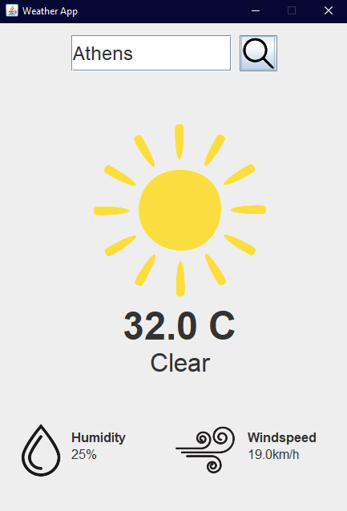

# 📌 Weather App



A real-time weather application built with Java Swing and Open-Meteo API.

## Features
- ✅ Real-time weather data
- ✅ Beautiful GUI
- ✅ Location-based search

## Installation
```bash
git clone https://github.com/yourusername/weather-app.git
cd weather-app
./gradlew run
