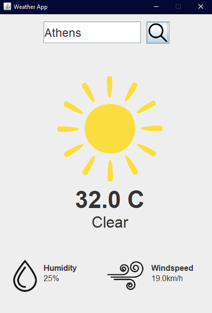

# 🌦️ Weather App (Java Swing)

  
*A real-time weather application with GUI built using Java Swing and Open-Meteo API.*

[](https://github.com/justsubway/weather-app)
[](LICENSE)
[](https://openjdk.org/)

## ✨ Features
- 🌍 Location-based weather search
- ☀️🌧️ Weather condition icons (Clear, Cloudy, Rain, Snow)
- 📊 Displays temperature, humidity, and wind speed
- 🖥️ Clean Swing GUI with responsive design

## 🛠️ Technologies
- **Java 17+**
- **Swing** (GUI)
- **Open-Meteo API** (Weather data)
- **JSON.simple** (API response parsing)

---

## 🚀 Quick Start

### Prerequisites
- JDK 17+ ([Download here](https://adoptium.net/))
- IntelliJ IDEA (or any Java IDE)
- json-simple-1.1.1 ([Download here](https://code.google.com/archive/p/json-simple/downloads))

### Running in IntelliJ IDEA
1. **Clone the repository**:
   ```bash
   git clone https://github.com/justsubway/weather-app.git
